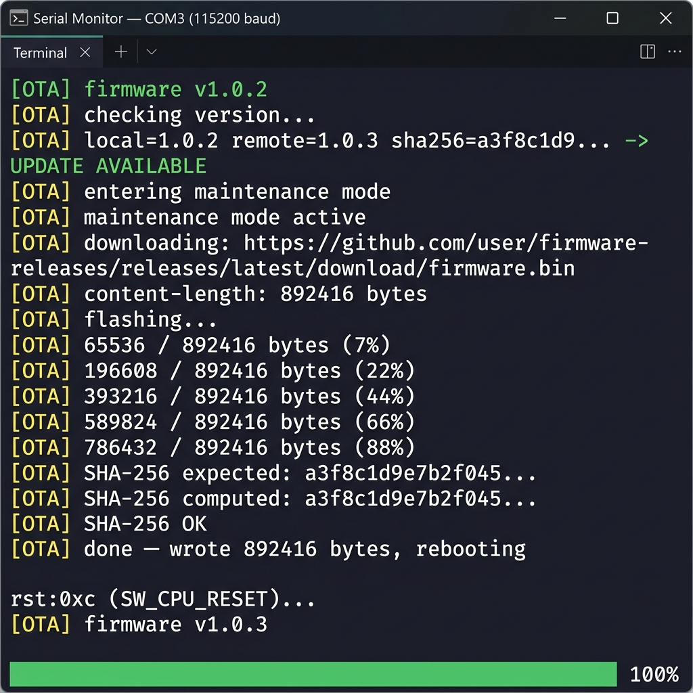
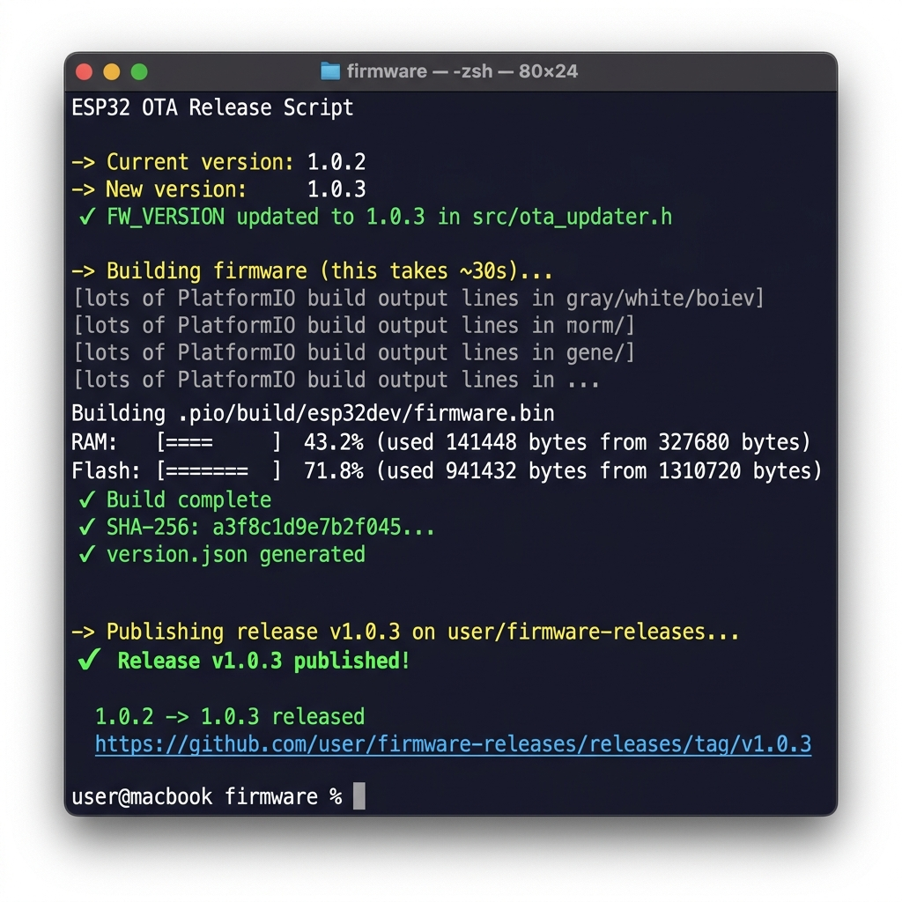
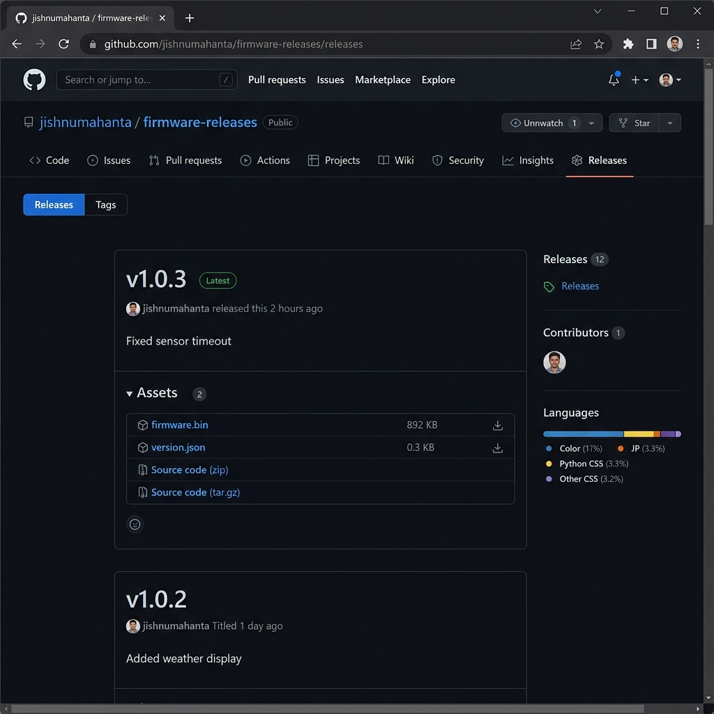
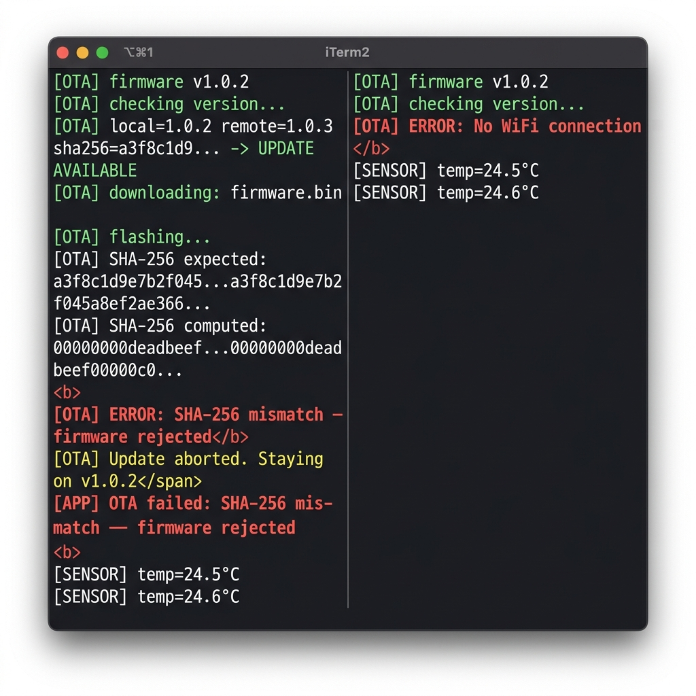

<div align="center">

# GitReleaseOTA

**Deployment infrastructure for ESP32 firmware — powered by GitHub Releases.**

Stream firmware OTA updates directly from GitHub Releases.  
SHA-256 integrity verification. FreeRTOS-safe. One-command release pipeline.

[](LICENSE)
[](https://platformio.org/lib/show/0/GitReleaseOTA)
[](https://www.arduino.cc/reference/en/libraries/)
[](https://github.com/jishnumahanta/GitReleaseOTA/releases/latest)
[](https://www.espressif.com/en/products/socs/esp32)

Built from production firmware powering [SMARTPlantMonitor](https://github.com/jishnumahanta) — an AI-powered ESP32-S3 IoT plant monitor.

</div>

---

## Why GitReleaseOTA?

| | ArduinoOTA | ElegantOTA | **GitReleaseOTA** |
|---|---|---|---|
| Transport | Local Wi-Fi | HTTP upload | **HTTPS GitHub CDN** |
| Custom server | ❌ Not needed | ✅ Required | **❌ Not needed** |
| SHA-256 integrity | ❌ | ❌ | **✅ Hardware-accelerated** |
| Release automation | ❌ | ❌ | **✅ One command** |
| CI/CD friendly | ❌ | ❌ | **✅ `gh release create`** |
| Version comparison | String | String | **✅ Semantic (1.10.0 > 1.9.0)** |
| Production-grade | ❌ | Partial | **✅** |

> **The real value**: No custom OTA server. No manual uploads. One command and every device in the field updates itself — with cryptographic integrity verification.

---

## OTA Update Flow

```
  ┌─────────────────────┐
  │    ESP32 Device      │  Running firmware v1.0.2
  └──────────┬──────────┘
             │  otaCheckAsync()
             ▼
  ┌─────────────────────┐
  │  Fetch version.json  │  github.com/.../releases/latest/download/
  └──────────┬──────────┘
             │  Parse & compare versions
             │  versionGreater("1.0.3", "1.0.2")  → true
             ▼
  ┌─────────────────────┐
  │  UPDATE_AVAILABLE    │
  └──────────┬──────────┘
             │  otaInstall()
             ▼
  ┌─────────────────────┐
  │  Download firmware   │  Streamed over HTTPS, 1 KB chunks
  └──────────┬──────────┘
             │  SHA-256 computed in real-time (mbedTLS)
             ▼
  ┌─────────────────────┐
  │  SHA-256 Verify      │  Compare against version.json hash
  └──────────┬──────────┘
             │  ✅ Match     ❌ Mismatch → abort, stay on v1.0.2
             ▼
  ┌─────────────────────┐
  │  OTA Partition Flash │  Written to inactive app partition
  └──────────┬──────────┘
             │  Update.end(true) — marks new partition bootable
             ▼
  ┌─────────────────────┐
  │  ESP.restart()       │  Boots from new partition → v1.0.3
  └─────────────────────┘
```

---

## Release Pipeline

```
  Developer Machine                     GitHub                 ESP32 Devices
  ─────────────────                     ──────                 ─────────────
  ./release.sh patch "Fix crash"
       │
       ├─ Read FW_VERSION from header   "1.0.2"
       ├─ Bump version                  1.0.2 → 1.0.3
       ├─ Write back to header          #define FW_VERSION "1.0.3"
       ├─ pio run  (build firmware.bin)
       ├─ shasum -a 256 firmware.bin
       ├─ Write version.json
       │    { "version": "1.0.3",
       │      "bin": "github.com/.../firmware.bin",
       │      "sha256": "a3f8c1...",
       │      "notes": "Fix crash" }
       │
       └─ gh release create v1.0.3 ──► GitHub Release
                                  firmware.bin ──► CDN
                                  version.json ──► CDN
                                                     │
                                          (next boot / scheduled)
                                                     │
                                  ESP32 otaCheckAsync() ◄────┘
                                  downloads & flashes v1.0.3
```

---

## Flash Partition Layout

```
  ESP32 Flash (4 MB)
  ┌──────────────────────────────────────────────────┐
  │  0x0000   Bootloader                             │
  ├──────────────────────────────────────────────────┤
  │  0x8000   Partition Table                        │
  ├──────────────────────────────────────────────────┤
  │  0x9000   NVS (Non-Volatile Storage)   20 KB     │
  ├──────────────────────────────────────────────────┤
  │  0xe000   OTA Data                      8 KB     │ ← tracks active slot
  ├──────────────────────────────────────────────────┤
  │  0x10000  app0 (ota_0)              1984 KB      │ ← ACTIVE: v1.0.2
  ├──────────────────────────────────────────────────┤
  │  0x200000 app1 (ota_1)              1984 KB      │ ← OTA writes here
  └──────────────────────────────────────────────────┘

  After Update.end(true):
  OTA Data flips → app1 becomes active at next boot
  app0 becomes the new inactive slot (next update target)
```

---

## OTA State Machine

```
            ┌─────────┐
            │OTA_IDLE │
            └────┬────┘
                 │ otaCheckAsync()
                 ▼
           ┌──────────┐
           │ CHECKING │
           └────┬─────┘
      ┌─────────┼──────────────────────────────┐
      │         │ version.json OK               │ error
      │         ▼                               ▼
      │  ┌─────────────┐           ┌──────────────────────┐
      │  │ UP_TO_DATE  │           │ ERROR_WIFI            │
      │  └─────────────┘           │ ERROR_HTTP            │
      │         │ update found      │ ERROR_PARSE           │
      │         ▼                  └──────────────────────┘
      │  ┌─────────────────┐
      │  │ UPDATE_AVAILABLE │
      │  └───────┬──────────┘
      │          │ otaInstall()
      │          ▼
      │  ┌─────────────┐
      │  │ DOWNLOADING  │──── stall / HTTP ──► ERROR_FLASH
      │  └──────┬──────┘
      │         │
      │         ▼
      │  ┌─────────────┐
      │  │  VERIFYING   │──── hash mismatch ──► ERROR_HASH
      │  └──────┬──────┘
      │         │ ✅
      │         ▼
      │  ┌─────────────┐
      │  │   SUCCESS    │──► ESP.restart()
      │  └─────────────┘
      │
      └──── retry after delay
```

---

## Serial Monitor Output

What you see on a successful OTA update:

```
[OTA] firmware v1.0.2
[OTA] checking version...
[OTA] local=1.0.2 remote=1.0.3 sha256=a3f8c1d9... -> UPDATE AVAILABLE
[OTA] entering maintenance mode
[OTA] maintenance mode active
[OTA] downloading: https://github.com/user/repo/releases/latest/download/firmware.bin
[OTA] content-length: 892416 bytes
[OTA] flashing...
[OTA] 65536 / 892416 bytes (7%)
[OTA] 196608 / 892416 bytes (22%)
[OTA] 393216 / 892416 bytes (44%)
[OTA] 589824 / 892416 bytes (66%)
[OTA] 786432 / 892416 bytes (88%)
[OTA] SHA-256 expected: a3f8c1d9e7b2f045...
[OTA] SHA-256 computed: a3f8c1d9e7b2f045...
[OTA] SHA-256 OK
[OTA] done — wrote 892416 bytes, rebooting

ets Jun  8 2016 00:22:57
rst:0xc (SW_CPU_RESET)...
[OTA] firmware v1.0.3      ← new firmware running
```



---

## Semantic Version Comparison

Many OTA systems compare versions as **strings**, which breaks at double-digit components:

```
String compare:  "1.10.0" < "1.9.0"  ← ❌ WRONG
Numeric compare: 1.10.0  > 1.9.0    ← ✅ CORRECT
```

GitReleaseOTA parses each component as integers:

```cpp
static bool versionGreater(const String &a, const String &b) {
  int ma=0,mi_a=0,pa=0, mb=0,mi_b=0,pb=0;
  sscanf(a.c_str(), "%d.%d.%d", &ma, &mi_a, &pa);
  sscanf(b.c_str(), "%d.%d.%d", &mb, &mi_b, &pb);
  if (ma!=mb)     return ma > mb;
  if (mi_a!=mi_b) return mi_a > mi_b;
  return pa > pb;
}
```

✅ `1.10.0 > 1.9.0` — correct  
✅ `2.0.0 > 1.99.99` — correct  
✅ `1.0.0 == 1.0.0` — no spurious update

---

## Features

- **GitHub Releases as OTA server** — no custom server, no infrastructure
- **SHA-256 integrity check** — hardware-accelerated via mbedTLS on all ESP32 variants
- **Proper semantic versioning** — `1.10.0 > 1.9.0`, not lexicographic
- **Non-blocking version check** — FreeRTOS task on core 0, never stalls `loop()`
- **Maintenance callback** — safely stop I2S, sensors, LEDs before flash begins
- **Redirect following** — handles GitHub's multi-step redirect chain automatically
- **Atomic OTA** — bad hash or mid-flash power loss leaves current firmware intact
- **Automated release script** — one command: bump → build → SHA-256 → publish

---

## Repository Structure

```
GitReleaseOTA/
├── src/
│   ├── ota_updater.h          # Header — include this in your project
│   └── ota_updater.cpp        # Implementation
├── examples/
│   ├── BasicOTA/
│   │   └── BasicOTA.ino       # Minimal working example
│   ├── FreeRTOSMultiTask/
│   │   └── FreeRTOSMultiTask.ino
│   └── ScheduledOTA/
│       └── ScheduledOTA.ino
├── release.sh                 # Release automation script
├── library.properties
└── README.md
```

---

## Setup

### Step 1 — Two GitHub repositories

- **Source repo** — your firmware code (private or public)
- **Releases repo** — hosts OTA assets (**must be public** so devices can download)

The releases repo can be empty — `release.sh` bootstraps it on first run.

### Step 2 — Install dependencies

```bash
brew install gh && gh auth login
# PlatformIO expected at ~/.platformio/penv/bin/pio
```

### Step 3 — Configure `release.sh`

```bash
GITHUB_USER="your-username"
GITHUB_REPO="your-releases-repo"
VERSION_FILE="src/ota_updater.h"
BUILD_ENV="esp32dev"
FIRMWARE_PATH=".pio/build/${BUILD_ENV}/firmware.bin"
```

```bash
chmod +x release.sh
```

### Step 4 — Configure your firmware

```cpp
#define FW_VERSION       "1.0.0"
#define OTA_GITHUB_USER  "your-username"
#define OTA_GITHUB_REPO  "your-releases-repo"
#include "ota_updater.h"
```

Or via `platformio.ini`:

```ini
build_flags =
    -D FW_VERSION='"1.0.0"'
    -D OTA_GITHUB_USER='"your-username"'
    -D OTA_GITHUB_REPO='"your-releases-repo"'
```

### Step 5 — Add to your firmware

```cpp
#include "ota_updater.h"

void beforeFlash() { i2sStop(); ledOff(); }

void setup() {
  Serial.begin(115200);
  WiFi.begin("SSID", "PASSWORD");
  while (WiFi.status() != WL_CONNECTED) delay(500);

  otaSetMaintenanceCallback(beforeFlash);
  otaInit();
  otaCheckAsync();
}

void loop() {
  if (otaGetState() == OTA_UPDATE_AVAILABLE) {
    String err = otaInstall();
    if (!err.isEmpty()) Serial.println("[OTA] failed: " + err);
  }
  delay(10);
}
```

For FreeRTOS tasks touching hardware, add to each task loop:

```cpp
if (g_otaInProgress) { vTaskDelay(pdMS_TO_TICKS(50)); continue; }
```

---

## Releasing a New Version

```bash
./release.sh patch "Fixed sensor timeout"
./release.sh minor "Added weather display"
./release.sh major "Rewrote audio pipeline"
```

The script automatically: reads version → bumps → writes back → builds → SHA-256 → generates `version.json` → creates GitHub Release.



---

## GitHub Releases

Each release automatically uploads `firmware.bin` and `version.json` to GitHub Releases, which acts as the CDN for all devices in the field:



---

## API Reference

```cpp
void        otaInit();                           // call once in setup()
void        otaSetMaintenanceCallback(void(*)()); // register pre-flash callback
void        otaCheckAsync();                     // non-blocking version check
String      otaInstall();                        // blocking: download → verify → flash → reboot
OtaState    otaGetState();
OtaInfo     otaGetInfo();                        // version, sha256, notes, updateAvailable
const char* otaStateStr(OtaState s);
extern volatile bool g_otaInProgress;            // check in your FreeRTOS tasks
```

### OtaState Values

| State | Meaning |
|---|---|
| `OTA_IDLE` | No check performed yet |
| `OTA_CHECKING` | Version check in progress |
| `OTA_UPDATE_AVAILABLE` | Remote version is semantically newer |
| `OTA_UP_TO_DATE` | Already on latest version |
| `OTA_DOWNLOADING` | Streaming firmware.bin |
| `OTA_VERIFYING` | SHA-256 comparison |
| `OTA_SUCCESS` | Flash complete — device reboots |
| `OTA_ERROR_WIFI` | No WiFi connection |
| `OTA_ERROR_HTTP` | HTTP request failed |
| `OTA_ERROR_PARSE` | `version.json` missing or malformed |
| `OTA_ERROR_FLASH` | Write to OTA partition failed |
| `OTA_ERROR_NO_SPACE` | Not enough flash for firmware |
| `OTA_ERROR_HASH` | SHA-256 mismatch — firmware rejected |

---

## Failure Recovery

| Scenario | Behaviour |
|---|---|
| Power loss during flash | Active partition untouched — device boots into previous firmware |
| SHA-256 mismatch | `Update.abort()` called immediately — binary discarded, state → `OTA_ERROR_HASH` |
| No WiFi at check time | State → `OTA_ERROR_WIFI` — call `otaCheckAsync()` again after reconnect |
| HTTP failure | Binary never downloaded — check repo is public and user/repo names are correct |
| Partition too small | `Update.begin()` fails → `OTA_ERROR_NO_SPACE` — fix `partitions.csv` |
| Corrupt `version.json` | State → `OTA_ERROR_PARSE` — binary never downloaded, devices stay on current version |



---

## Rollback Roadmap

ESP-IDF supports application rollback natively. Planned for a future release:

```cpp
// Mark firmware as valid after healthy boot
void otaMarkValid();
// If not called within N seconds, auto-rollback to previous OTA slot
```

**Current**: if new firmware crashes on boot, manually trigger `ESP.restart()` — the previous OTA slot remains available. A watchdog timer is a recommended workaround.

---

## Partition Requirements

```csv
# Name,   Type, SubType,  Offset,   Size,     Flags
nvs,      data, nvs,      0x9000,   0x5000,
otadata,  data, ota,      0xe000,   0x2000,
app0,     app,  ota_0,    0x10000,  0x1F0000,
app1,     app,  ota_1,    0x200000, 0x1F0000,
```

```ini
board_build.partitions = partitions.csv
```

> **Tip**: For ESP32-S3 with 8 MB flash, allocate `0x3C0000` per OTA slot to accommodate large LVGL/WiFi/BLE builds.

---

## Examples

### FreeRTOS Multi-Task

```cpp
#define FW_VERSION      "1.0.0"
#define OTA_GITHUB_USER "your-username"
#define OTA_GITHUB_REPO "your-releases-repo"
#include "ota_updater.h"

void sensorTask(void*) {
  for (;;) {
    if (g_otaInProgress) { vTaskDelay(pdMS_TO_TICKS(50)); continue; }
    // read sensor ...
    vTaskDelay(pdMS_TO_TICKS(100));
  }
}

void beforeFlash() { i2sStop(); ledOff(); }

void setup() {
  WiFi.begin("SSID", "PASSWORD");
  while (WiFi.status() != WL_CONNECTED) delay(500);
  xTaskCreatePinnedToCore(sensorTask, "sensor", 4096, nullptr, 2, nullptr, 1);
  otaSetMaintenanceCallback(beforeFlash);
  otaInit();
  otaCheckAsync();
}

void loop() {
  if (otaGetState() == OTA_UPDATE_AVAILABLE) otaInstall();
  delay(100);
}
```

### Scheduled OTA (Every 6 Hours)

```cpp
unsigned long lastCheck = 0;
const unsigned long INTERVAL = 6UL * 60 * 60 * 1000;

void loop() {
  if (millis() - lastCheck > INTERVAL) {
    otaCheckAsync();
    lastCheck = millis();
  }
  if (otaGetState() == OTA_UPDATE_AVAILABLE) otaInstall();
  delay(100);
}
```

---

## Security Notes

- **Transport**: HTTPS (TLS encrypted). `setInsecure()` skips certificate validation — acceptable because the URL is hardcoded and SHA-256 provides content integrity.
- **Content integrity**: SHA-256 is computed over the entire binary during streaming and compared against the hash in `version.json`. Tampered or corrupted binaries are rejected.
- **OTA partition**: Targets `U_FLASH` (inactive app partition). LittleFS / SPIFFS is untouched.
- **Hardening**: To pin the CA cert for `github.com`, replace `setInsecure()` with the appropriate certificate.

---

## License

MIT — use freely, modify as needed.

---

<div align="center">

Built with ❤️ for embedded engineers who ship to production.

**[GitHub](https://github.com/jishnumahanta/GitReleaseOTA)** · **[Issues](https://github.com/jishnumahanta/GitReleaseOTA/issues)** · **[SmartPot](https://github.com/jishnumahanta)**

</div>
